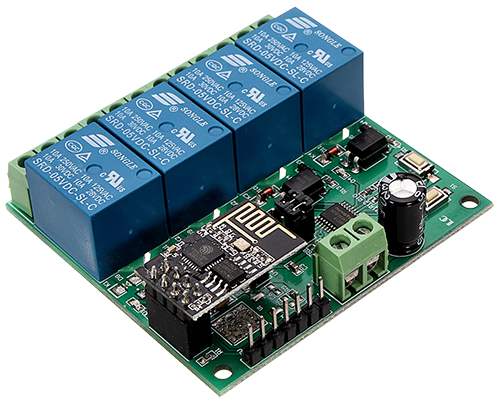
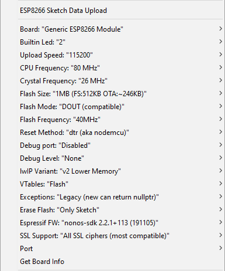

## Features
- Hybrid operation mode (STA & AP)
- WebSocket-based GUI
- Concurrent multi-user support
- Automatic time synchronization over NTP
- Time zone selection
- 24h on/off scheduler
- 4-channel relay switch

## Manual relay control


## Scheduler


## Installation
This project is designed to work with [4-channel relay module](http://www.icstation.com/esp8266-wifi-channel-relay-module-remote-control-switch-wireless-transmitter-smart-home-p-13420.html), which uses an onboard MCU that controlls the relays according to the commands received from ESP-01 over UART.



0. Make sure that [ESP8266 Core](https://github.com/esp8266/Arduino) is installed in your Arduino IDE. 
1. Open __src\GrowLight\GrowLight.ino__
2. Customize SSID and PWD for STA mode:
```cpp
wifiMulti.addAP("ssid_from_AP_1", "your_password_for_AP_1");
wifiMulti.addAP("ssid_from_AP_2", "your_password_for_AP_2");
wifiMulti.addAP("ssid_from_AP_3", "your_password_for_AP_3");
```
3. Customize SSID and PWD for AP mode:
```cpp
const char *ssid = "GrowBox";
const char *password = "GrowBox2020";
```
4. Set board settings



5. Compile and upload the code
6. Upload webserver to SPIFFS using Tools/__ESP8266 Sketch Data Upload__

## Credits
- [A Beginner's Guide to the ESP8266](https://tttapa.github.io/ESP8266/Chap01%20-%20ESP8266.html)
- [WebSocket Server and Client for Arduino](https://github.com/Links2004/arduinoWebSockets)
- [NTPClient](https://github.com/arduino-libraries/NTPClient)
- [Time Range Wheel Slider (Circular Knob Slider)](https://github.com/jpweinerdev/timerangewheelslider)

